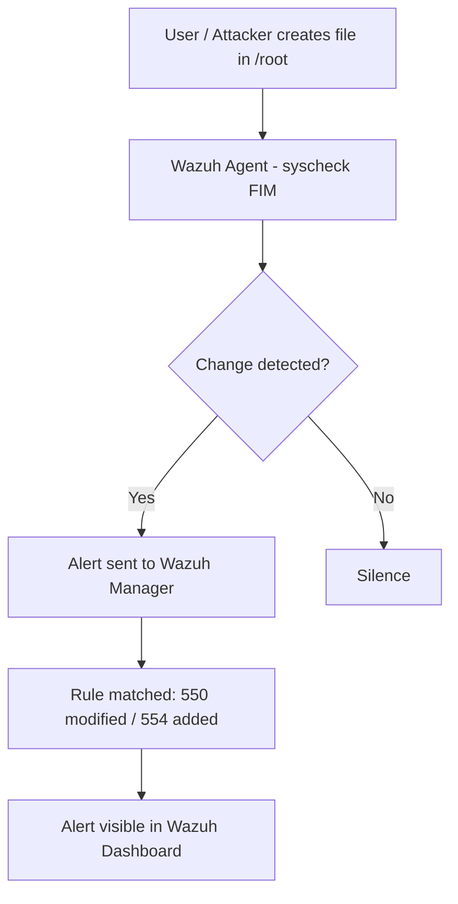

# Lab 01 — File Integrity Monitoring with Wazuh

## Summary

This lab configures **Wazuh's File Integrity Monitoring (FIM)** module to watch the `/root` directory on an Ubuntu agent in real time. Any file creation, modification, or deletion triggers an alert on the Wazuh Manager dashboard. This is one of the most fundamental detection capabilities a blue team deploys — it forms the backbone of change auditing on sensitive servers.

---

## Architecture & Data Flow

```
Ubuntu Agent (/root monitored by FIM)
        |
        | File event detected (create / modify / delete)
        v
Wazuh Agent (syscheck module)
        |
        | Alert forwarded over encrypted channel (port 1514)
        v
Wazuh Manager
        |
        | Event decoded, rule matched (rule 550 / 554)
        v
Wazuh Dashboard — Security Events
```

---

## Mermaid Diagram



---

## Prerequisites

| Component | Version / Notes |
|-----------|----------------|
| Wazuh Manager | 4.x, running on a dedicated server or VM |
| Wazuh Agent | Installed on Ubuntu 20.04 / 22.04 |
| Ubuntu Agent VM | Any user account with sudo access |
| Network | Agent can reach Manager on port 1514 (UDP/TCP) |

---

## Theory Background

### What is File Integrity Monitoring (FIM)?

Every file on a Linux system has metadata: owner, permissions, size, and a cryptographic hash of its content. FIM works by taking a **baseline snapshot** of these properties and then continuously (or periodically) comparing the live state against that snapshot. Any deviation — a new file appearing, a config file being edited, a binary being replaced — is flagged immediately.

**Why does this matter?**

- An attacker who gains a foothold often drops a web shell, a backdoor binary, or modifies `/etc/passwd` or `/etc/sudoers`.
- Ransomware encrypts files — FIM would see thousands of simultaneous modifications.
- Insider threats quietly alter configurations or exfiltrate data by placing files in staging directories.
- Compliance frameworks (PCI-DSS, HIPAA, SOC 2) explicitly require FIM on sensitive paths.

### How Wazuh FIM Works

Wazuh's `syscheck` module has two modes:

- **Scheduled scan** — scans at a fixed interval (default: every 6 hours). Lightweight but has latency.
- **Realtime monitoring** — uses Linux's `inotify` kernel mechanism to get instant notification of changes. Lower latency, slightly higher resource use.

When `check_all="yes"` is set, Wazuh checks: file hash (MD5, SHA1, SHA256), size, owner, group, permissions, inode, and modification time.

---

## Step-by-Step Instructions

### Part 1 — Configure the Wazuh Manager

**1. Open the Manager configuration file:**

```bash
sudo nano /var/ossec/etc/ossec.conf
```

**2. Find the `<global>` block and enable full JSON logging:**

```xml
<global>
  <logall>yes</logall>
  <logall_json>yes</logall_json>
</global>
```

> **Why?** Enabling `logall` stores every event (not just alerts) in `/var/ossec/logs/archives/`. This is useful for forensic review and for tools like Elasticsearch ingesting raw logs.

**3. Restart the Wazuh Manager:**

```bash
sudo systemctl restart wazuh-manager
sudo systemctl status wazuh-manager
```

---

### Part 2 — Configure the Wazuh Agent

**1. Open the Agent configuration file:**

```bash
sudo nano /var/ossec/etc/ossec.conf
```

**2. Locate the `<syscheck>` block. It should already exist. Verify it is enabled and add the `/root` directory:**

```xml
<syscheck>
  <disabled>no</disabled>

  <!-- Monitor /root with all checks, real-time, and content diff -->
  <directories check_all="yes" report_changes="yes" realtime="yes">/root</directories>
</syscheck>
```

| Attribute | Meaning |
|-----------|---------|
| `check_all="yes"` | Check hash, size, owner, group, permissions, inode, mtime |
| `report_changes="yes"` | Show a diff of what changed inside text files |
| `realtime="yes"` | Use Linux inotify for instant detection (not scheduled scan) |

**3. Restart the Wazuh Agent:**

```bash
sudo systemctl restart wazuh-agent
sudo systemctl status wazuh-agent
```

---

### Part 3 — Verification & Test Simulation

**1. Create a test file in `/root` on the Ubuntu agent:**

```bash
sudo touch /root/testfile.txt
```

**2. Modify the file:**

```bash
echo "sensitive data" | sudo tee -a /root/testfile.txt
```

**3. Delete the file:**

```bash
sudo rm /root/testfile.txt
```

**4. Navigate to Wazuh Dashboard → Security Events and filter by `syscheck`.**

---

## Expected Alerts & How to Read Them

### Alert: File Added (Rule 554)

```json
{
  "rule": {
    "id": "554",
    "level": 5,
    "description": "File added to the system."
  },
  "syscheck": {
    "path": "/root/testfile.txt",
    "event": "added",
    "sha256_after": "e3b0c44298fc1c149afbf4c8996fb92427ae41e4649b934ca495991b7852b855",
    "size_after": "0",
    "uname_after": "root",
    "gname_after": "root",
    "perm_after": "100644"
  },
  "agent": {
    "name": "ubuntu-agent",
    "ip": "192.168.43.142"
  },
  "timestamp": "2025-06-01T10:23:45.000Z"
}
```

### Alert: File Modified (Rule 550)

```json
{
  "rule": {
    "id": "550",
    "level": 7,
    "description": "Integrity checksum changed."
  },
  "syscheck": {
    "path": "/root/testfile.txt",
    "event": "modified",
    "sha256_before": "e3b0c44298fc1c149afbf4c8996fb92427ae41e4649b934ca495991b7852b855",
    "sha256_after":  "9a8b7c6d5e4f3a2b1c0d9e8f7a6b5c4d3e2f1a0b9c8d7e6f5a4b3c2d1e0f9a8",
    "size_before": "0",
    "size_after": "15",
    "changed_attributes": ["size", "sha256"]
  }
}
```

**Key fields to look at:**
- `rule.id` — 550 = modified, 554 = added, 553 = deleted
- `syscheck.path` — which file changed
- `syscheck.sha256_before` / `sha256_after` — cryptographic proof of the change
- `changed_attributes` — exactly what property changed

---

## Troubleshooting

| Problem | Likely Cause | Fix |
|---------|-------------|-----|
| No alerts appearing | Agent not sending to Manager | Check `sudo systemctl status wazuh-agent` and verify Manager IP in `ossec.conf` |
| Alerts delayed by minutes | `realtime` not set | Confirm `realtime="yes"` is present in `<directories>` tag |
| `inotify` errors in agent log | Too many watches or kernel limit | Run `sudo sysctl -w fs.inotify.max_user_watches=524288` |
| `syscheck` block missing | Default install may omit it | Add the full `<syscheck>` block manually |
| Manager not restarting | Config syntax error | Run `sudo /var/ossec/bin/ossec-logtest` to validate config |

---

## Real-World Relevance

In a SOC environment, FIM on critical paths is treated as a **tier-1 alert**. Paths typically monitored in production include:

- `/etc/passwd`, `/etc/shadow`, `/etc/sudoers` — privilege escalation indicators
- `/var/www/html` — web shell detection
- `/bin`, `/usr/bin`, `/usr/sbin` — binary replacement / rootkit detection
- `/etc/cron.d`, `/etc/cron.daily` — persistence mechanism detection

A SOC analyst receiving a FIM alert would:
1. Check the `sha256_after` hash against VirusTotal.
2. Identify the process that made the change (correlate with auditd or Sysmon).
3. Determine if the change was authorized (via change management records).
4. Escalate if unauthorized — this could be active intrusion or insider threat.

---

## What I Learned

- Wazuh FIM uses Linux `inotify` for real-time file change detection — no polling overhead.
- The `check_all` attribute captures far more than just the hash; permissions and ownership changes are equally critical signals.
- `report_changes="yes"` is powerful for text config files — it shows exactly which line was edited.
- Enabling `logall_json` on the Manager side is important for full SIEM ingestion pipelines.
- Rule IDs 550, 553, 554 are the core FIM rules — knowing these by number is useful when writing custom correlation rules.
