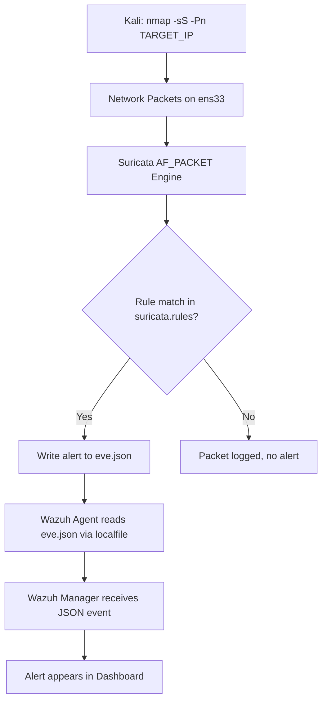

# Lab 02 — Network Intrusion Detection with Suricata + Wazuh

## Summary

This lab integrates **Suricata**, an open-source Network Intrusion Detection System (NIDS), with Wazuh on an Ubuntu agent. Suricata monitors live network traffic against a ruleset of known attack signatures and outputs structured JSON logs. Wazuh ingests these logs and surfaces them as alerts on the dashboard. An Nmap port scan from a Kali machine is used to trigger and validate the detection pipeline.

---

## Architecture & Data Flow

```
Kali Attacker (nmap -sS -Pn)
        |
        | Raw network packets on interface ens33
        v
Suricata (AF_PACKET capture on Ubuntu Agent)
        |
        | Signature matched → writes to /var/log/suricata/eve.json
        v
Wazuh Agent (localfile monitor of eve.json)
        |
        | JSON alert forwarded to Wazuh Manager
        v
Wazuh Manager — decodes, correlates, displays
        v
Wazuh Dashboard — Security Events
```

---

## Mermaid Diagram



---

## Prerequisites

| Component | Version / Notes |
|-----------|----------------|
| Wazuh Manager | 4.x |
| Ubuntu Agent | 20.04 / 22.04, connected to Wazuh Manager |
| Suricata | 6.x or 7.x (installed via OISF PPA) |
| Kali Linux | Attacker machine, `nmap` pre-installed |
| Network | Both VMs on the same subnet; Ubuntu interface known (`ifconfig`) |

---

## Theory Background

### What is a NIDS?

A **Network Intrusion Detection System** sits on a network interface and inspects every packet passing through. It compares packet payloads, headers, and connection patterns against a library of known attack **signatures** (like antivirus definitions, but for network traffic).

Think of it like an airport x-ray scanner — it doesn't block bags, but it raises an alarm when something matches a threat pattern.

**Suricata** is one of the two dominant open-source NIDS engines (the other being Snort). It is multi-threaded, supports Lua scripting for custom rules, and produces structured JSON output via its **EVE (Extensible Event Format)** log, which is ideal for SIEM ingestion.

### What is AF_PACKET?

AF_PACKET is a Linux kernel mechanism that allows a user-space application (Suricata) to read raw packets directly off a network interface — without them going through the normal TCP/IP stack. This gives Suricata visibility into all traffic at layer 2 and above, including scans that use non-standard TCP flags (like Nmap's SYN scan).

### What is an Nmap SYN Scan?

`nmap -sS` (SYN scan, also called a "half-open" or "stealth" scan) sends TCP SYN packets to target ports. It never completes the three-way handshake — it just listens for SYN-ACK (port open) or RST (port closed). This is fast and harder to log in application-layer logs, but Suricata detects it at the packet level.

### Suricata Rules

Each Suricata rule has the format:

```
action proto src_ip src_port -> dest_ip dest_port (options; sid:ID; rev:N;)
```

Example rule that fires on Nmap SYN scans:
```
alert tcp any any -> $HOME_NET any (msg:"SCAN nmap SYN scan"; flags:S; threshold: type both, track by_src, count 20, seconds 1; sid:1000001; rev:1;)
```

The community ruleset from Emerging Threats (downloaded via `suricata-update`) contains thousands of such rules.

---

## Step-by-Step Instructions

### Part 1 — Install Suricata on the Ubuntu Agent

**1. Add the official OISF stable PPA and install:**

```bash
sudo add-apt-repository ppa:oisf/suricata-stable -y
sudo apt update
sudo apt install suricata suricata-update -y
```

**2. Verify the installation:**

```bash
sudo suricata -V
```

Expected output: `This is Suricata version 7.x.x RELEASE`

**3. Download and update the community rule set:**

```bash
sudo suricata-update
```

This fetches the **Emerging Threats Open** ruleset and places it at `/var/lib/suricata/rules/suricata.rules`.

**4. Verify rules were downloaded:**

```bash
ls -lh /var/lib/suricata/rules/
```

You should see `suricata.rules` with a file size in the megabytes range (typically 30,000+ rules).

---

### Part 2 — Identify the Network Interface

```bash
ifconfig
```

Note the interface name handling your lab traffic — commonly `ens33` on VMware, `eth0` on bare metal, or `enp0s3` on VirtualBox.

> **Important:** Using the wrong interface means Suricata captures nothing. Confirm with `ip a` if `ifconfig` is not installed.

---

### Part 3 — Configure Suricata

```bash
sudo nano /etc/suricata/suricata.yaml
```

**Key settings to configure:**

**a) Set your network range (replace with your actual subnet):**

```yaml
vars:
  address-groups:
    HOME_NET: "[192.168.43.142/24]"
    EXTERNAL_NET: "any"
```

**b) Set the rule path:**

```yaml
default-rule-path: /var/lib/suricata/rules

rule-files:
  - suricata.rules
```

**c) Configure EVE JSON output (find the `outputs` section):**

```yaml
outputs:
  - eve-log:
      enabled: yes
      filetype: regular
      filename: /var/log/suricata/eve.json
      types:
        - alert
        - http
        - dns
        - tls
        - flow
```

**d) Set the capture interface:**

```yaml
af-packet:
  - interface: ens33
```

> Replace `ens33` with your actual interface name from the `ifconfig` output.

---

### Part 4 — Test and Start Suricata

**1. Validate the configuration syntax:**

```bash
sudo suricata -T -c /etc/suricata/suricata.yaml
```

Expected: `Configuration provided was successfully loaded. Exiting.`

**2. Enable and start Suricata:**

```bash
sudo systemctl enable suricata
sudo systemctl restart suricata
sudo systemctl status suricata
```

**3. Verify EVE log is being written:**

```bash
sudo tail -f /var/log/suricata/eve.json
```

You should see DNS, flow, or HTTP events even without an active attack.

---

### Part 5 — Integrate Suricata with Wazuh Agent

```bash
sudo nano /var/ossec/etc/ossec.conf
```

Add this block before `</ossec_config>`:

```xml
<localfile>
  <log_format>json</log_format>
  <location>/var/log/suricata/eve.json</location>
</localfile>
```

**Restart the Wazuh Agent:**

```bash
sudo systemctl restart wazuh-agent
sudo systemctl status wazuh-agent
```

---

### Part 6 — Attack Simulation (from Kali)

Run an Nmap SYN scan targeting the Ubuntu Agent's IP:

```bash
nmap -sS -Pn 192.168.43.142
```

| Flag | Meaning |
|------|---------|
| `-sS` | SYN (half-open) scan — stealthy, triggers IDS rules |
| `-Pn` | Skip ping — assume host is up, scan all ports |

---

## Expected Alerts & How to Read Them

### Suricata EVE Alert Entry

```json
{
  "timestamp": "2025-06-01T11:05:23.441234+0000",
  "event_type": "alert",
  "src_ip": "192.168.43.100",
  "src_port": 52341,
  "dest_ip": "192.168.43.142",
  "dest_port": 22,
  "proto": "TCP",
  "alert": {
    "action": "allowed",
    "gid": 1,
    "signature_id": 2009582,
    "rev": 4,
    "signature": "ET SCAN Nmap Scripting Engine User-Agent Detected",
    "category": "Web Application Attack",
    "severity": 1
  },
  "flow": {
    "pkts_toserver": 1,
    "pkts_toclient": 0
  }
}
```

**Key fields:**
- `event_type: "alert"` — only alert-type events are security-relevant
- `src_ip` — attacker's IP (your Kali machine)
- `alert.signature` — the rule that fired; this is your detection summary
- `alert.severity` — 1 = high, 2 = medium, 3 = low in Suricata's scale
- `alert.signature_id` — cross-reference with Emerging Threats rule database

### In Wazuh Dashboard

Wazuh maps Suricata alerts to its own rule tree under **rule group `suricata`**. Look for:

- `rule.id: 86601` — Suricata alert detected
- The `data.alert.signature` field carries the full Suricata rule name

---

## Troubleshooting

| Problem | Likely Cause | Fix |
|---------|-------------|-----|
| Suricata fails to install | Dependency conflicts | `sudo apt --fix-broken install -y` then retry |
| `suricata-update` not found | Installed separately | `sudo apt install suricata-update -y` or `pip3 install suricata-update` |
| No alerts from Nmap scan | Wrong interface | Re-check `ifconfig`, update `af-packet.interface` in yaml |
| `eve.json` not updating | Suricata not running | `sudo systemctl status suricata`, check logs at `/var/log/suricata/suricata.log` |
| Wazuh not showing Suricata events | localfile block missing | Verify the `<localfile>` block is present and agent was restarted |
| Config test fails | YAML syntax error | YAML is whitespace-sensitive; ensure consistent 2-space indentation |

**Fix broken install sequence:**

```bash
sudo apt --fix-broken install -y
sudo apt remove suricata-update -y
sudo apt install suricata -y
sudo suricata-update
```

---

## Real-World Relevance

In a real SOC deployment, Suricata (or its commercial equivalent) runs on a **network tap or SPAN port** that mirrors all traffic flowing through a core switch. This gives visibility into:

- **East-west traffic** — lateral movement between internal hosts
- **C2 beaconing** — malware phoning home to command-and-control servers
- **Data exfiltration** — large outbound transfers to unknown IPs
- **Exploit attempts** — payloads matching known CVE signatures

Wazuh's integration means every Suricata alert is enriched with agent context (hostname, IP) and can trigger automated responses — blocking an IP, isolating a host, or creating a JIRA ticket.

---

## What I Learned

- AF_PACKET gives Suricata zero-copy access to raw packets directly from the kernel — this is why it can detect scans before they complete the TCP handshake.
- The EVE JSON format is intentionally designed for SIEM ingestion — every event type (alert, dns, http, flow) is a separate JSON object with consistent structure.
- `HOME_NET` and `EXTERNAL_NET` variables determine rule directionality — misconfiguring these causes many rules to never fire.
- `suricata-update` is separate from Suricata itself and needs to be run periodically (ideally via cron) to keep signatures current.
- Suricata's `-T` flag for config testing is essential before restarting the service in production.
