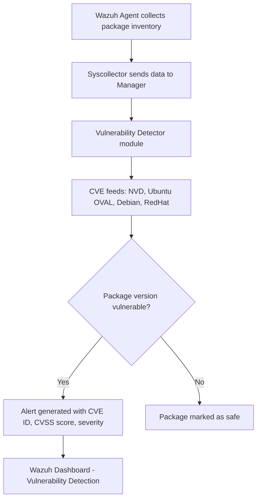

# Lab 03 — Vulnerability Detection with Wazuh Vulnerability Detector

## Summary

This lab enables **Wazuh's built-in Vulnerability Detector** module, which cross-references the software packages installed on connected agents against public CVE (Common Vulnerabilities and Exposures) databases. No external scanner is needed — Wazuh queries the agent's package inventory and flags vulnerable versions automatically. Results appear on the Wazuh dashboard under the **Vulnerability Detection** section.

---

## Architecture & Data Flow

```
Ubuntu Agent
        |
        | Package inventory collected by Wazuh Agent syscollector
        | (dpkg list, kernel version, Python packages, etc.)
        v
Wazuh Manager — Vulnerability Detector module
        |
        | Compares package versions against NVD / Ubuntu OVAL CVE feeds
        v
Vulnerability report generated per agent
        v
Wazuh Dashboard → Vulnerability Detection → Inventory
```

---

## Mermaid Diagram



---

## Prerequisites

| Component | Version / Notes |
|-----------|----------------|
| Wazuh Manager | 4.x (Vulnerability Detector built-in) |
| Ubuntu Agent | 20.04 / 22.04 — with syscollector enabled |
| Internet access | Manager needs to download CVE feeds on first run |
| Disk space | ~500 MB for CVE database on Manager |

---

## Theory Background

### What is a CVE?

A **Common Vulnerability and Exposure (CVE)** is a standardized identifier for a publicly known security vulnerability. For example, `CVE-2021-44228` is the identifier for the infamous Log4Shell vulnerability.

Each CVE has:
- A **CVSS score** (0.0–10.0) rating its severity
- A **severity label**: Critical, High, Medium, Low, Informational
- A description of the flaw and affected versions
- References to patches and mitigations

### What is the NVD?

The **National Vulnerability Database (NVD)**, maintained by NIST, is the authoritative repository of CVEs. Linux distributions (Ubuntu, Debian, Red Hat) also maintain their own **OVAL (Open Vulnerability Assessment Language)** feeds that map CVEs to specific package versions in their repos.

### How Wazuh's Vulnerability Detector Works

1. The **Syscollector** module on the Wazuh Agent periodically collects an inventory of installed packages (via `dpkg`, `rpm`, etc.), running processes, and the kernel version.
2. This inventory is sent to the Wazuh Manager.
3. The **Vulnerability Detector** module compares each package name + version against the CVE feeds it has downloaded.
4. Any match generates a vulnerability alert with the CVE ID, CVSS score, and a description.

This is **passive** detection — no network scan, no exploitation attempt. It is purely a version comparison. This means it catches known-unpatched software but won't find zero-days or misconfigurations.

### Why This Matters

Most real-world breaches exploit **known vulnerabilities in unpatched software** — not sophisticated zero-days. Running a vulnerability detector is the single most cost-effective way to reduce your attack surface. Even without a dedicated scanner like Nessus or Qualys, Wazuh's built-in module provides continuous, agent-based coverage at no extra licensing cost.

---

## Step-by-Step Instructions

### Part 1 — Enable Vulnerability Detection on the Manager

By default, the Vulnerability Detector is **disabled**. Enable it in the Manager config:

```bash
sudo nano /var/ossec/etc/ossec.conf
```

Find or add the `<vulnerability-detector>` block. A minimal configuration enabling Ubuntu support:

```xml
<vulnerability-detector>
  <enabled>yes</enabled>
  <interval>5m</interval>
  <min_full_scan_interval>6h</min_full_scan_interval>
  <run_on_start>yes</run_on_start>

  <!-- Ubuntu feed -->
  <provider name="canonical">
    <enabled>yes</enabled>
    <os>focal</os>        <!-- Ubuntu 20.04 -->
    <os>jammy</os>        <!-- Ubuntu 22.04 -->
    <update_interval>1h</update_interval>
  </provider>

  <!-- National Vulnerability Database -->
  <provider name="nvd">
    <enabled>yes</enabled>
    <update_from_year>2020</update_from_year>
    <update_interval>1h</update_interval>
  </provider>
</vulnerability-detector>
```

> **Note:** Match the `<os>` tag to the Ubuntu codename of your agent. `focal` = 20.04, `jammy` = 22.04.

### Part 2 — Verify Syscollector is Enabled on the Agent

```bash
sudo nano /var/ossec/etc/ossec.conf
```

Confirm this block exists and is not disabled:

```xml
<wodle name="syscollector">
  <disabled>no</disabled>
  <interval>1h</interval>
  <packages>yes</packages>
  <os>yes</os>
  <hotfixes>yes</hotfixes>
</wodle>
```

### Part 3 — Restart the Wazuh Manager

```bash
sudo systemctl restart wazuh-manager
sudo systemctl status wazuh-manager
```

**Watch the Manager logs to confirm CVE feeds are downloading:**

```bash
sudo tail -f /var/ossec/logs/ossec.log | grep -i "vuln"
```

You should see lines like:
```
INFO: Starting vulnerability scan on agent 'ubuntu-agent'
INFO: NVD feed successfully updated.
```

### Part 4 — View Results in the Dashboard

1. Open Wazuh Dashboard.
2. Navigate to **Vulnerability Detection** in the left menu.
3. Select your agent.
4. Browse the **Inventory** tab — packages are listed with CVE IDs, severity, and CVSS scores.

---

## Expected Output & How to Read It

### Vulnerability Alert Example

```json
{
  "rule": {
    "id": "23505",
    "level": 10,
    "description": "CVE-2023-0286 affects libssl3 in Ubuntu 22.04"
  },
  "vulnerability": {
    "cve": "CVE-2023-0286",
    "title": "X.400 address type confusion in X.509 GeneralName",
    "severity": "High",
    "cvss3": {
      "base_score": 7.4,
      "vector": "CVSS:3.1/AV:N/AC:H/PR:N/UI:N/S:U/C:H/I:N/A:H"
    },
    "package": {
      "name": "libssl3",
      "version": "3.0.2-0ubuntu1.7",
      "architecture": "amd64"
    },
    "fix": "3.0.2-0ubuntu1.9",
    "published": "2023-02-08",
    "state": "Fixed"
  },
  "agent": {
    "name": "ubuntu-agent",
    "ip": "192.168.43.142"
  }
}
```

**Key fields to review:**
- `vulnerability.cve` — the CVE ID; search this on NVD or MITRE for full details
- `vulnerability.severity` — Critical/High need immediate patching attention
- `vulnerability.cvss3.base_score` — scores 9.0–10.0 are critical
- `vulnerability.fix` — the patched version to upgrade to
- `vulnerability.state` — "Fixed" means a patch is available; "Unfixed" means no patch exists yet

---

## Troubleshooting

| Problem | Likely Cause | Fix |
|---------|-------------|-----|
| No vulnerabilities showing at all | Detector not enabled | Check the `<enabled>yes</enabled>` tag under `<vulnerability-detector>` |
| Dashboard shows "No data" | Syscollector hasn't run yet | Wait 5–10 min after agent restart; check `interval` setting |
| Feed download fails | No internet on Manager | Ensure Manager can reach `https://feed.wazuh.com` and NVD endpoints |
| Wrong OS feed | `<os>` tag mismatch | Run `lsb_release -cs` on the agent and match the codename |
| Manager log shows errors | Config XML syntax error | Validate with `sudo /var/ossec/bin/wazuh-logtest` |

---

## Real-World Relevance

In a production environment, vulnerability detection is typically part of a broader **Vulnerability Management (VM) program**:

1. **Discover** — identify all assets and their software inventory (Wazuh does this passively)
2. **Assess** — determine which CVEs apply (Wazuh's detector)
3. **Prioritize** — rank by CVSS score, asset criticality, exploit availability
4. **Remediate** — patch, upgrade, or mitigate
5. **Verify** — re-scan to confirm the fix

Wazuh's approach is **agent-based** (as opposed to network-based scanners like Nessus), which means it can see packages on isolated hosts with no network access and produces no scan traffic that could disrupt services.

SOC and vulnerability management teams use the dashboard to generate **weekly patch reports** showing which systems have critical-severity CVEs that have been open for more than N days — a key metric in most compliance frameworks.

---

## What I Learned

- Vulnerability detection doesn't require an active scanner — agent-based inventory comparison is more accurate and less disruptive.
- CVSS scores are not the only priority signal — a CVSS 6 vulnerability with a public exploit is often more urgent than a CVSS 9 with no known exploitation.
- The `run_on_start: yes` flag makes the first scan happen immediately after the manager restarts — useful for verifying the setup.
- Wazuh pulls CVE data from both NVD and OS-specific OVAL feeds — the OVAL feeds are more accurate for package version matching on Debian/Ubuntu systems.
- Keeping `update_interval` reasonably short (1h) ensures new CVEs published throughout the day are caught without a long lag.
