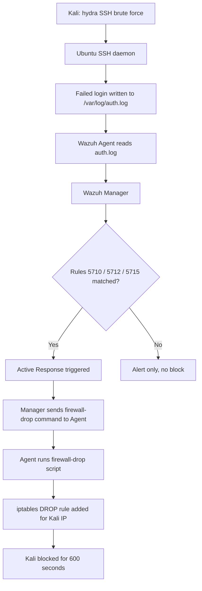

# Lab 05 — Detecting and Blocking SSH Brute Force Attacks with Wazuh Active Response

## Summary

This lab demonstrates **Wazuh's Active Response** capability. Hydra (a password-cracking tool on Kali Linux) launches an SSH brute force attack against the Ubuntu Agent. Wazuh detects the repeated failed authentication attempts, matches built-in SSH brute force rules, and automatically deploys a firewall block (`iptables DROP`) on the attacker's IP — without any human intervention. This is a foundational automated defense technique used in real SOC environments.

---

## Architecture & Data Flow

```
Kali Attacker
    |
    | hydra -l root -P pass.txt ssh://192.168.43.142
    v
Ubuntu Agent — SSH daemon logs failed attempts to /var/log/auth.log
    |
    | Wazuh Agent reads auth.log (syslog format)
    v
Wazuh Manager — matches rules 5710/5712/5715 (SSH brute force)
    |
    | Active Response triggered: firewall-drop command
    v
Wazuh Agent — executes firewall-drop script
    |
    | iptables -I INPUT -s <kali_ip> -j DROP
    v
Kali IP is blocked at the OS level — SSH connection attempts fail
```

---

## Mermaid Diagram



---

## Prerequisites

| Component | Version / Notes |
|-----------|----------------|
| Wazuh Manager | 4.x |
| Ubuntu Agent | 20.04 / 22.04 with SSH daemon running |
| Kali Linux | Attacker VM — `hydra` pre-installed |
| `iptables` | Present on Ubuntu agent (default) |
| Network | Kali can reach Ubuntu on port 22 |

**Install Hydra on Kali if not present:**
```bash
sudo apt install hydra -y
```

---

## Theory Background

### What is a Brute Force Attack?

A brute force attack against SSH systematically tries username and password combinations until it finds valid credentials. Tools like **Hydra** and **Medusa** automate this at hundreds of attempts per second.

Even with strong passwords, brute force attacks:
- Consume server resources (CPU, file handles)
- Generate enormous log noise
- Can succeed if weak passwords exist anywhere in the system

### How Wazuh Detects It

Wazuh ships with built-in rules for SSH authentication events. The relevant rule chain is:

| Rule ID | Trigger | Level |
|---------|---------|-------|
| 5710 | SSH authentication failure | 5 |
| 5712 | Multiple SSH authentication failures | 10 |
| 5715 | SSH brute force — 8+ failures in 120s from same IP | 10 |
| 5760 | SSH login after brute force attempts | 10 |
| 5763 | SSH brute force (variation) | 10 |

Rules 5712/5715 use **frequency-based correlation** — they only fire after N failures within a time window, which filters out accidental typos vs. actual brute force.

### What is Active Response?

Wazuh's **Active Response** is an automated countermeasure framework. When a rule fires, the Manager can instruct any connected Agent to run a pre-defined script. The built-in `firewall-drop` script adds an `iptables` DROP rule blocking the attacker's source IP for a configurable timeout period.

This is the simplest form of **automated incident response** — detection and containment happen in seconds with zero human latency.

### Security Note

Auto-blocking carries a risk of **IP spoofing attacks** where an attacker spoofs a legitimate IP (e.g., a monitoring server or a gateway) to trigger a false block. In production, you would add IP exceptions in the active response config and pair this with IP reputation feeds.

---

## Step-by-Step Instructions

### Part 1 — Verify SSH Log Monitoring on the Agent

```bash
sudo nano /var/ossec/etc/ossec.conf
```

Confirm this block exists (it is usually present by default):

```xml
<localfile>
  <log_format>syslog</log_format>
  <location>/var/log/auth.log</location>
</localfile>
```

If absent, add it before `</ossec_config>`.

---

### Part 2 — Verify Brute Force Rules Exist

In Wazuh Dashboard: **Management → Rules → Manage Rules Files → search "sshd"**

Alternatively on the Manager:

```bash
sudo grep -r "5715\|5712\|5710" /var/ossec/ruleset/rules/
```

Confirm rules 5710, 5712, and 5715 are present. These are part of the default `0095-sshd_rules.xml` ruleset.

---

### Part 3 — Enable Active Response on the Manager

```bash
sudo nano /var/ossec/etc/ossec.conf
```

Add before `</ossec_config>`:

```xml
<active-response>
  <command>firewall-drop</command>
  <location>all</location>
  <rules_id>5710,5712,5715,5760,5763</rules_id>
  <timeout>600</timeout>
</active-response>
```

| Tag | Meaning |
|-----|---------|
| `<command>` | Script to run — `firewall-drop` uses iptables |
| `<location>all</location>` | Run on both Manager and Agent |
| `<rules_id>` | Only trigger for these specific rule IDs |
| `<timeout>600</timeout>` | Block lasts 600 seconds (10 minutes), then auto-removes |

**Verify the firewall-drop command definition exists.** If not, add it:

```bash
sudo grep -A5 "firewall-drop" /var/ossec/etc/shared/ar.conf
```

If the command block is missing from `ossec.conf`, add it:

```xml
<command>
  <name>firewall-drop</name>
  <executable>firewall-drop</executable>
  <timeout_allowed>yes</timeout_allowed>
</command>
```

---

### Part 4 — Verify the Agent Can Execute firewall-drop

```bash
sudo ls /var/ossec/active-response/bin/
```

You should see `firewall-drop` in the listing. This is the script the Agent will run.

---

### Part 5 — Enable Active Response on the Agent

```bash
sudo nano /var/ossec/etc/ossec.conf
```

Ensure this block is present and not disabled (it usually exists by default):

```xml
<active-response>
  <disabled>no</disabled>
</active-response>
```

---

### Part 6 — Restart Both Services

```bash
# On Manager
sudo systemctl restart wazuh-manager

# On Agent
sudo systemctl restart wazuh-agent
```

---

### Part 7 — Attack Simulation (from Kali)

**1. Create a password list:**

```bash
cat > pass.txt << EOF
password
123456
admin
root
toor
letmein
qwerty
password123
EOF
```

**2. Launch the brute force attack:**

```bash
hydra -l root -P pass.txt ssh://192.168.43.142
```

| Flag | Meaning |
|------|---------|
| `-l root` | Try username `root` |
| `-P pass.txt` | Use this password wordlist |
| `ssh://IP` | Target SSH on that IP |

Hydra will attempt each password rapidly, triggering repeated failed auth events.

---

### Part 8 — Verify the Block

**On the Ubuntu Agent — watch active responses live:**

```bash
sudo tail -f /var/ossec/logs/active-responses.log
```

Expected output:
```
Sat Jun  1 11:15:33 UTC 2025 /var/ossec/active-response/bin/firewall-drop add - 192.168.43.100 1234567890.123 5715
```

**Verify iptables rule was added:**

```bash
sudo iptables -L INPUT -n | grep 192.168.43.100
```

Expected:
```
DROP  all  --  192.168.43.100  0.0.0.0/0
```

**From Kali — verify you are now blocked:**

```bash
ssh user@192.168.43.142
```

The connection should hang or immediately refuse.

---

## Expected Alerts & How to Read Them

### Wazuh Alert for SSH Brute Force

```json
{
  "rule": {
    "id": "5715",
    "level": 10,
    "description": "sshd: brute force trying to get access to the system.",
    "frequency": 8,
    "groups": ["authentication_failures", "sshd"]
  },
  "data": {
    "srcip": "192.168.43.100",
    "dstuser": "root"
  },
  "agent": {
    "name": "ubuntu-agent",
    "ip": "192.168.43.142"
  },
  "timestamp": "2025-06-01T11:15:32.000Z"
}
```

### Active Response Log Entry

```
Sat Jun  1 11:15:33 UTC 2025 /var/ossec/active-response/bin/firewall-drop add - 192.168.43.100 1717236933.456 5715
Sat Jun  1 11:25:33 UTC 2025 /var/ossec/active-response/bin/firewall-drop delete - 192.168.43.100 1717236933.456 5715
```

The `add` line shows when the block was applied. The `delete` line shows when the 600-second timeout expired and the block was automatically removed.

---

## Troubleshooting

| Problem | Likely Cause | Fix |
|---------|-------------|-----|
| No alerts from hydra attack | Auth log not monitored | Verify `<localfile>` block for `/var/log/auth.log` in agent config |
| Active response not triggering | Command definition missing | Add `<command>` block with `firewall-drop` to `ossec.conf` on Manager |
| `firewall-drop` not found | Agent script missing | Check `/var/ossec/active-response/bin/`; re-install wazuh-agent if absent |
| Hydra blocked before threshold | iptables from a previous test | `sudo iptables -F INPUT` to flush existing rules, then retry |
| Block applied but Kali still connects | Wrong IP in rule | Confirm Kali's actual IP with `ip a`; check `iptables -L -n` |
| Block not auto-removed after 600s | Active response delete failed | Manually: `sudo iptables -D INPUT -s KALI_IP -j DROP` |

**Manually remove a blocked IP:**

```bash
sudo iptables -D INPUT -s 192.168.43.100 -j DROP
```

---

## Real-World Relevance

SSH brute force is one of the **most common automated attacks** targeting internet-facing servers. Shodan scans show that servers with SSH exposed on port 22 begin receiving brute force attempts within minutes of going online.

Real-world defenses combine multiple layers:
- **Wazuh Active Response** — fast automated block (as in this lab)
- **fail2ban** — similar iptables-based auto-blocking
- **Port knocking** — SSH only opens after a secret port sequence
- **Key-only authentication** — disable password auth entirely (`PasswordAuthentication no` in `sshd_config`)
- **Non-standard port** — reduces noise but not a real security control

In a SOC, brute force alerts are often auto-escalated if the attacker IP achieves a successful login after attempts — that transition from `rule 5715` to `rule 5760` (successful login) is treated as a **confirmed compromise indicator** and triggers an immediate incident response.

---

## What I Learned

- Wazuh's active response framework bridges detection and containment — detection fires a rule, which fires a command, which modifies the firewall. No human needed.
- The `<frequency>` field in brute force rules is what distinguishes automated attacks from human typos — a single failed login doesn't fire 5715.
- `iptables -L -n` is the ground truth for verifying whether a block is actually in place — the Wazuh dashboard shows the intent, iptables shows the result.
- The `<timeout>` parameter auto-removes blocks — this is important because permanent blocks without review can accumulate and cause legitimate access issues.
- The Active Response log at `/var/ossec/logs/active-responses.log` is the audit trail for every automated action taken — essential for incident reporting.
