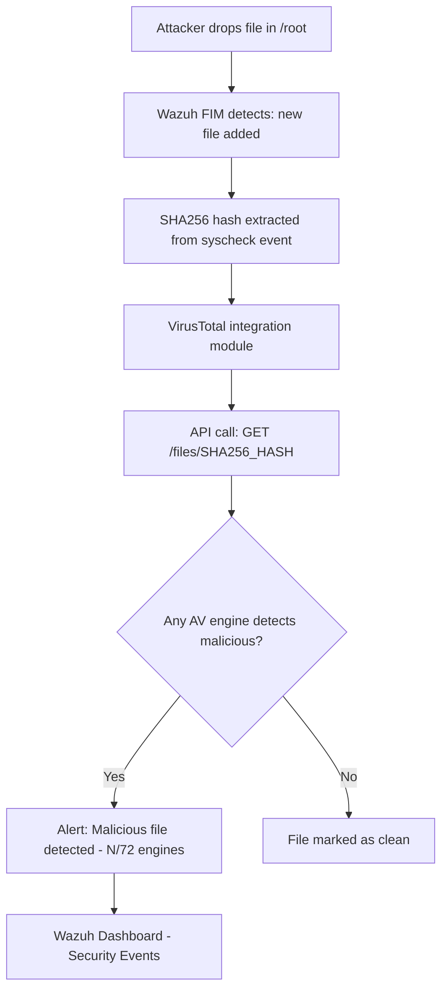

# Lab 06 — VirusTotal Integration with Wazuh FIM

## Summary

This lab extends the File Integrity Monitoring setup (Lab 01) by connecting Wazuh to the **VirusTotal API**. When a new or modified file is detected in `/root`, Wazuh extracts the file's SHA256 hash and automatically queries VirusTotal's database of 70+ antivirus engines. If any engine flags the file as malicious, a high-severity alert is generated. This is demonstrated by dropping the **EICAR test file** — a universally recognized benign file that all AV engines flag as malware for testing purposes.

---

## Architecture & Data Flow

```
Ubuntu Agent (/root monitored by FIM)
        |
        | File dropped: /root/eicar.com
        v
Wazuh Agent syscheck detects file addition
        |
        | SHA256 hash computed and event sent to Manager
        v
Wazuh Manager — custom rules 100201/100200 match FIM event
        |
        | VirusTotal integration triggered with SHA256
        v
VirusTotal API (https://www.virustotal.com/api/v3/)
        |
        | Returns: X/72 engines detect as malicious
        v
Wazuh Manager generates VirusTotal alert
        v
Wazuh Dashboard — Security Events (high severity)
```

---

## Mermaid Diagram



---

## Prerequisites

| Component | Version / Notes |
|-----------|----------------|
| Wazuh Manager | 4.x |
| Ubuntu Agent | 20.04 / 22.04 with FIM enabled on `/root` |
| VirusTotal Account | Free account at virustotal.com (API key required) |
| Internet access | Manager must reach `https://www.virustotal.com` |
| Lab 01 complete | FIM on `/root` should already be configured |

---

## Theory Background

### What is VirusTotal?

**VirusTotal** (owned by Google/Alphabet) is a free online service that aggregates results from 70+ antivirus engines, URL scanners, and sandbox analysis tools. You can submit a file, a URL, or an IP address and receive a verdict from every engine simultaneously.

Its value in security operations comes from **collective intelligence** — even if your organization's local AV doesn't have a signature for a new piece of malware, VirusTotal's crowdsourced database likely does.

### How the Integration Works

When Wazuh FIM detects a file change that matches a custom rule (100200 for modifications, 100201 for new files), the `<integration>` module intercepts the alert and:

1. Extracts the SHA256 hash from the `syscheck` alert
2. Makes a REST API call to VirusTotal: `GET https://www.virustotal.com/api/v3/files/{hash}`
3. Parses the response — specifically the `last_analysis_stats` field which shows how many engines detected the file
4. If any detections exist, generates a new alert with the VirusTotal verdict

### What is the EICAR Test File?

The **EICAR Standard Anti-Virus Test File** is a 68-byte text file developed by the European Institute for Computer Antivirus Research. It is not malware — it cannot execute and does nothing harmful. However, every legitimate antivirus engine is programmed to detect it as `EICAR-Test-File`.

This makes it perfect for testing detection pipelines: it's safe, legal, small, and 100% guaranteed to be flagged by VirusTotal.

### API Rate Limits

The VirusTotal free tier allows **4 lookups per minute** and **500 per day**. In a busy environment with many FIM events, you may hit this limit. Wazuh handles this gracefully — failed lookups are logged but don't break the system. The paid API tier removes these limits.

---

## Step-by-Step Instructions

### Part 1 — Get a VirusTotal API Key

1. Go to [https://www.virustotal.com](https://www.virustotal.com)
2. Create a free account
3. Click your profile picture (top right) → **API Key**
4. Copy the API key — you'll need it in Part 4

---

### Part 2 — Ensure FIM is Enabled on the Agent

```bash
sudo nano /var/ossec/etc/ossec.conf
```

Confirm the `<syscheck>` block monitors `/root`:

```xml
<syscheck>
  <disabled>no</disabled>
  <directories check_all="yes" report_changes="yes" realtime="yes">/root</directories>
</syscheck>
```

**Restart agent:**

```bash
sudo systemctl restart wazuh-agent
```

**Quick test — verify FIM events are reaching the Manager:**

```bash
sudo touch /root/testfile
```

Check Wazuh Dashboard → Discover → search `syscheck` — you should see a file-added event.

---

### Part 3 — Add Custom FIM Rules on the Manager

Navigate to: **Wazuh GUI → Management → Rules → Manage Rules Files → local_rules.xml**

Or edit directly:

```bash
sudo nano /var/ossec/etc/rules/local_rules.xml
```

Add:

```xml
<group name="root_monitoring,syscheck">

  <rule id="100200" level="7">
    <if_sid>550</if_sid>
    <field name="file">/root</field>
    <description>File modified in /root directory.</description>
  </rule>

  <rule id="100201" level="7">
    <if_sid>554</if_sid>
    <field name="file">/root</field>
    <description>File added to /root directory.</description>
  </rule>

</group>
```

| Rule | Parent SID | Meaning |
|------|-----------|---------|
| 100200 | 550 (modified) | Specifically track modifications in `/root` |
| 100201 | 554 (added) | Specifically track new files in `/root` |

These rules act as **VirusTotal triggers** — the integration will only fire for these rule IDs.

---

### Part 4 — Configure the VirusTotal Integration on the Manager

```bash
sudo nano /var/ossec/etc/ossec.conf
```

Add before `</ossec_config>`:

```xml
<integration>
  <name>virustotal</name>
  <api_key>YOUR_VIRUSTOTAL_API_KEY_HERE</api_key>
  <rule_id>100200,100201</rule_id>
  <alert_format>json</alert_format>
</integration>
```

> Replace `YOUR_VIRUSTOTAL_API_KEY_HERE` with the key copied from Step 1.

**Restart the Manager:**

```bash
sudo systemctl restart wazuh-manager
sudo systemctl status wazuh-manager
```

---

### Part 5 — Drop the EICAR Test File

On the Ubuntu Agent:

```bash
sudo curl -Lo /root/eicar.com https://secure.eicar.org/eicar.com
sudo ls -lah /root/eicar.com
```

The file will be approximately 68 bytes. Display its content (it's just text):

```bash
cat /root/eicar.com
```

Output:
```
X5O!P%@AP[4\PZX54(P^)7CC)7}$EICAR-STANDARD-ANTIVIRUS-TEST-FILE!$H+H*
```

---

### Part 6 — View the Alert

Wait 30–60 seconds for the pipeline to complete:

1. FIM detects the file → rule 100201 fires
2. Integration sends SHA256 to VirusTotal API
3. VirusTotal returns detections
4. Wazuh generates a VirusTotal alert

Check Wazuh Dashboard → **Security Events** → filter by `virustotal`.

---

## Expected Alerts & How to Read Them

### FIM Alert (rule 100201)

```json
{
  "rule": {
    "id": "100201",
    "level": 7,
    "description": "File added to /root directory."
  },
  "syscheck": {
    "path": "/root/eicar.com",
    "event": "added",
    "sha256_after": "275a021bbfb6489e54d471899f7db9d1663fc695ec2fe2a2c4538aabf651fd0f",
    "size_after": "68",
    "uname_after": "root"
  }
}
```

### VirusTotal Integration Alert

```json
{
  "rule": {
    "id": "87105",
    "level": 12,
    "description": "VirusTotal: Alert - /root/eicar.com - 72 engines detected this file"
  },
  "data": {
    "virustotal": {
      "found": 1,
      "malicious": 72,
      "source": {
        "file": "/root/eicar.com",
        "sha256": "275a021bbfb6489e54d471899f7db9d1663fc695ec2fe2a2c4538aabf651fd0f"
      },
      "permalink": "https://www.virustotal.com/gui/file/275a021bbfb6489e54d471899f7db9d1663fc695ec2fe2a2c4538aabf651fd0f"
    }
  }
}
```

**Key fields:**
- `data.virustotal.malicious` — number of AV engines that flagged the file (72/72 for EICAR)
- `data.virustotal.source.sha256` — the hash that was queried
- `data.virustotal.permalink` — direct link to the VT analysis page for manual review

---

## Troubleshooting

| Problem | Likely Cause | Fix |
|---------|-------------|-----|
| No VirusTotal alert | Integration not configured | Check `<integration>` block is present and manager was restarted |
| `API key invalid` in logs | Wrong key | Re-copy from virustotal.com → Profile → API Key |
| No FIM event for eicar.com | syscheck not watching `/root` | Verify `<directories>` tag includes `/root` with `realtime="yes"` |
| Alert appears but no VT data | Rate limit hit | Free tier: 4 req/min; wait and retry |
| `curl: SSL error` downloading EICAR | TLS/cert issue | Try `--insecure` flag or download from an alternate source |
| Manager fails to restart | Integration XML syntax error | Validate with `sudo /var/ossec/bin/wazuh-logtest` |

**Check integration logs:**

```bash
sudo tail -f /var/ossec/logs/integrations.log
```

---

## Real-World Relevance

VirusTotal integration is a **force multiplier** for a small security team. Rather than maintaining local AV signatures across hundreds of endpoints, a single integration point provides access to 70+ engines simultaneously.

In a SOC, this capability is used for:

- **Malware triage** — automatically score every file dropped on a monitored server
- **Threat hunting** — look up hashes from memory dumps or disk images
- **Incident response** — quickly determine if a suspicious file is known malware or a zero-day
- **Vendor correlation** — if only 1/72 engines detects a file as malicious, it may be a false positive

The EICAR test case demonstrates that even without an active breach, teams can **validate the entire detection pipeline** — FIM → custom rule → integration → VirusTotal → alert — before a real incident occurs. This pipeline-validation mindset is essential in professional blue team work.

---

## What I Learned

- VirusTotal lookups are hash-based — Wazuh doesn't upload the file itself, only the SHA256 fingerprint. This is important for privacy and is how most threat intel platforms work.
- Custom rules (100200/100201) act as a filter — the VT integration only fires for these IDs, preventing API rate limit exhaustion from low-priority FIM events.
- The EICAR file is the universal test standard — knowing it and using it correctly demonstrates professional lab practice.
- Integration logs at `/var/ossec/logs/integrations.log` are the first place to debug when VirusTotal alerts aren't appearing.
- A "clean" VirusTotal result (0 detections) is not a guarantee of safety — zero-day malware won't have signatures yet. VT is one layer of many.
